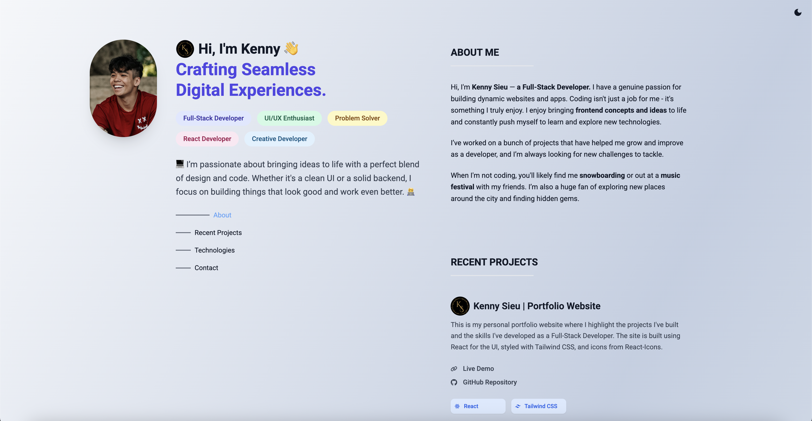
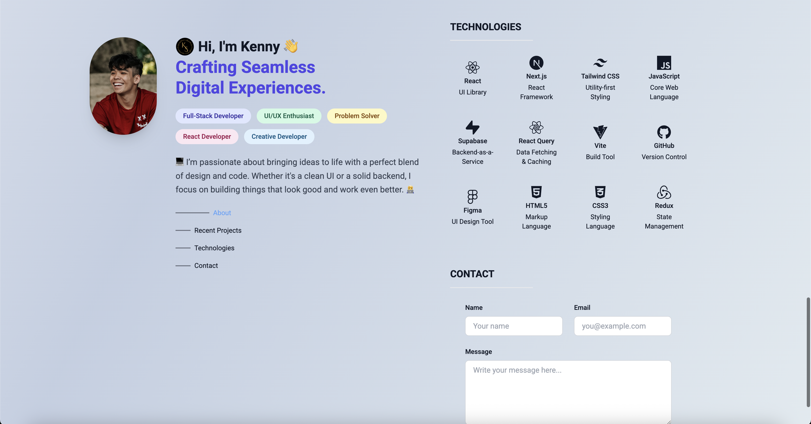

# **Portfolio 🌐**

A modern, responsive personal portfolio app to showcase projects, skills, and contact information. Includes light and dark mode for a personalized experience.

---

## 📸 Screenshots

All screenshots are located in `public/screenshots/`.

<div align="center">

### Home (Light)



### Home (Dark)


### Technologies



</div>

---

## 🗂 Project Structure

```
portfolio/
├── public/          # Static assets
├── src/             # React components & pages
└── package.json     # App configuration
```

---

## ⚙️ Getting Started

### ✅ Prerequisites

- Node.js (v18 or later recommended)
- npm or yarn

---

### 📦 Installation

1. **Clone the repository:**

```bash
git clone https://github.com/yourusername/portfolio.git
```

2. **Install dependencies:**

```bash
cd portfolio
npm install
```

---

### 🚀 Run Locally

```bash
npm run dev
```

Runs on: `http://localhost:5173`

---

## 🛠 Features

- 🌗 Light & Dark mode toggle
- 🖼 Responsive design for mobile & desktop
- 📂 Sections for projects, skills, and contact info

---

## 🙋‍♂️ Author

Your Name
🧑‍💻 GitHub: \[[https://github.com/kkennethsieu](https://github.com/kkennethsieu)]
🌐 Portfolio: \[[https://kenny-sieu-portfolio.vercel.app/](https://kenny-sieu-portfolio.vercel.app/)]
